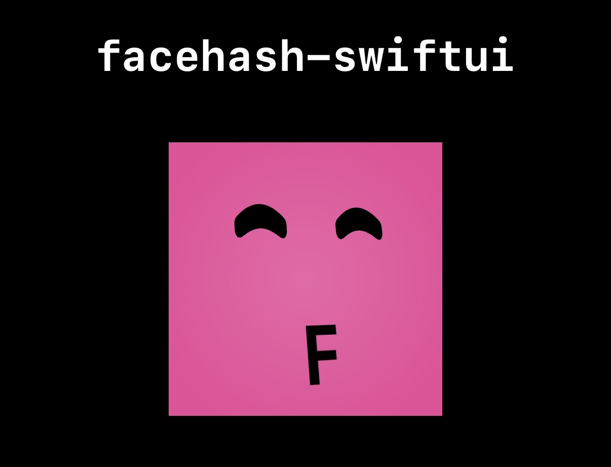

# facehash-swiftui

A SwiftUI port of [facehash](https://www.facehash.dev).

Deterministic avatar faces from any string. Zero dependencies, works with SwiftUI on iOS 16+ and macOS 13+.

<p align="center">
  
</p>

## Installation

### Swift Package Manager

Add to your `Package.swift`:

```swift
dependencies: [
    .package(url: "https://github.com/jonathan-lor/facehash-swiftui", from: "1.0.0"),
]
```

Or in Xcode: **File > Add Package Dependencies** and paste the repository URL.

## Quick Start

```swift
import Facehash

FacehashView(name: "john@example.com")
```

Same string = same face. Always.

## Parameters

| Parameter | Type | Default | Description |
|-----------|------|---------|-------------|
| `name` | `String` | Required | String to generate face from |
| `size` | `CGFloat` | `40` | Size in points |
| `colors` | `[Color]?` | `nil` | Custom color palette (uses default when nil) |
| `variant` | `Variant` | `.gradient` | Background style |
| `intensity3D` | `Intensity3D` | `.dramatic` | 3D rotation effect |
| `interactive` | `Bool` | `true` | Animate on hover (macOS) / tap (iOS) |
| `showInitial` | `Bool` | `true` | Show first letter below face |
| `enableBlink` | `Bool` | `false` | Enable random eye blinking animation |
| `faceColor` | `Color` | `.primary` | Color for the eyes and initial letter |
| `mouth` | `@ViewBuilder` | - | Custom mouth renderer (replaces initial) |

## Examples

### Custom Colors

```swift
FacehashView(
    name: "alice",
    colors: [
        Color(hex: "#264653"),
        Color(hex: "#2a9d8f"),
        Color(hex: "#e9c46a"),
        Color(hex: "#f4a261"),
        Color(hex: "#e76f51"),
    ]
)
```

### Flat Style (No 3D)

```swift
FacehashView(name: "charlie", intensity3D: .none, variant: .solid)
```

### Without Initial Letter

```swift
FacehashView(name: "diana", showInitial: false)
```

### Eye Blinking Animation

```swift
FacehashView(name: "alive", enableBlink: true)
```

The blinking uses randomized timing derived from the name hash for a natural, chaotic effect.

### Custom Mouth Renderer

Replace the initial letter with any custom view:

```swift
// Show a spinner as the "mouth"
FacehashView(name: "loading") {
    ProgressView()
}

// Custom icon
FacehashView(name: "bot") {
    Image(systemName: "cpu")
        .font(.system(size: 12))
}

// Combine with blinking for a "thinking" avatar
FacehashView(name: "thinking", enableBlink: true) {
    ProgressView()
}
```

### Custom Face Color

```swift
FacehashView(name: "ghost", faceColor: .white)
FacehashView(name: "dark", faceColor: .black)
FacehashView(name: "accent", faceColor: .orange)
```

### Intensity Levels

```swift
FacehashView(name: "Hello", intensity3D: .subtle)
FacehashView(name: "Hello", intensity3D: .medium)
FacehashView(name: "Hello", intensity3D: .dramatic)
```

## Avatar with Image Fallback

For image avatars that fall back to Facehash when the image fails to load:

```swift
import Facehash

AvatarView(
    url: URL(string: "https://example.com/photo.jpg"),
    name: "john@example.com",
    size: 40
)
```

## Color Palettes

Three built-in palettes are available:

```swift
FacehashColors.default  // pink, amber, blue, orange, emerald
FacehashColors.light    // lighter variants
FacehashColors.dark     // darker variants
```

## Exports

```swift
// Main view
FacehashView(name:size:variant:intensity3D:interactive:showInitial:colors:enableBlink:faceColor:)

// Avatar with image fallback
AvatarView(url:name:size:variant:intensity3D:interactive:showInitial:colors:enableBlink:faceColor:)

// Core data (for custom implementations)
computeFacehash(name:colorsLength:)  // Returns FacehashData
stringHash(_:)                        // Deterministic hash function

// Types
FaceType          // .round, .cross, .line, .curved
Variant           // .gradient, .solid
Intensity3D       // .none, .subtle, .medium, .dramatic
FacehashData      // faceType, colorIndex, rotation, initial

// Color palettes
FacehashColors.default
FacehashColors.light
FacehashColors.dark
```

## License

MIT
